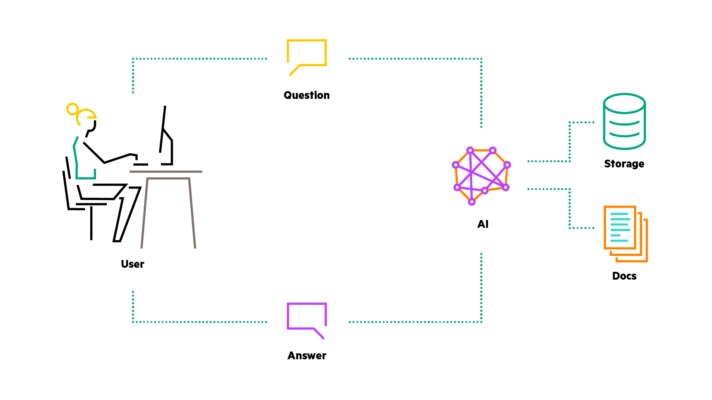
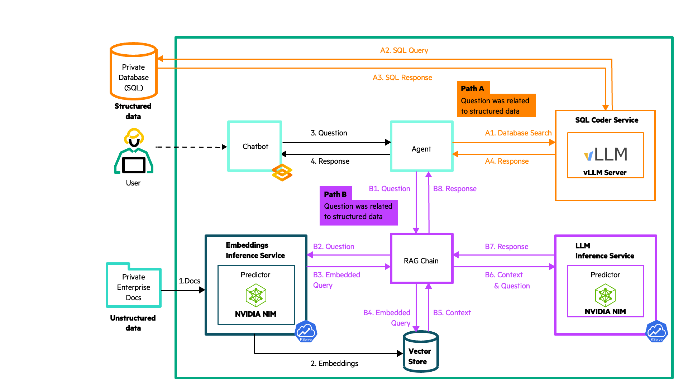

# Chatbot

In this tutorial, you build a Chatbot that uses a RAG (Retrieval Augmented Generation) system to
answer user queries leveraging both an SQL and a Vector database. 

To make this happen, you:

* Deploy an embeddings model, using KServe.
* Deploy an SQL Coder LLM that can translate user queries to SQL statements.
* Deploy an LLM to respond to inquiries, leveraging the context extracted from the two databases, in
  a natural language format.
* Deploy an agent that decides whether to use the Vector or the SQL database to answer a specific
  user query.

1. [What You'll Need](#what-youll-need)
1. [Procedure](#procedure)
1. [Troubleshooting](#troubleshooting)
1. [Clean Up](#clean-up)
1. [References](#references)

## What You'll Need

For this tutorial, ensure you have:

- Access to an HPE Ezmeral Unified Analytics (EzUA) cluster.
- An API Token to pull images from NVIDIA NGC catalog.
- A Hugging Face token to pull models from Hugging Face Hub.

## Procedure

To complete the tutorial follow the steps below:

1. Login to your EzUA cluster, using your credentials.
1. Create a new Notebook server using the
   `marketplace.us1.greenlake-hpe.com/ezmeral/ezkf/jupyter:v1.3.0-e658264` image.
   Request at least `4Gi` of memory for the Notebook server, `4` CPUs and `1` GPU device.
1. Connect to the Notebook server, launch a new terminal window, and clone the repository locally.
   See the troubleshooting section if this step fails.
1. Navigate to the tutorial's directory (`chatbot`)
1. Launch the setup Notebook to create the necessary Kubernetes secrets.
1. Use the EzUA "Import Framework" wizard to upload the `chatbot.tgz` tarball located in the
   `deployment` directory. This creates a user interface for your application and deploys all the
   necessary components. Complete the steps and wait for a new endpoint to become ready.
1. Connect to the endpoint and submit your questions.

## Troubleshooting

If you're operating behind a proxy, you'll need to configure several environment variables to
successfully clone the `ezua-tutorials` repository to your local machine.

Launch a terminal window and execute the following commands:

- `export http_proxy=<your http proxy URL>`
- `export https_proxy=<your https proxy URL>`

## Clean Up

To clean up the resources used during this experiment, follow the steps below:

1. Go to the EzUA "Import Framework" dashboard and delete the application.
1. Remove the Kubernetes secrets you created by running the setup Notebook.

## References

1. [A High-Level Introduction To Word Embeddings](https://predictivehacks.com/a-high-level-introduction-to-word-embeddings/)
1. [Nearest Neighbor Indexes for Similarity Search](https://www.pinecone.io/learn/series/faiss/vector-indexes/)
1. [Efficient Memory Management for Large Language Model Serving with PagedAttention](https://arxiv.org/abs/2309.06180)
1. [FlashAttention: Fast and Memory-Efficient Exact Attention with IO-Awareness](https://arxiv.org/abs/2205.14135)
